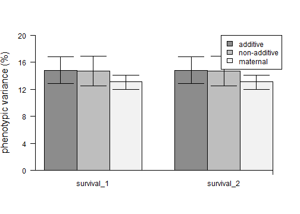

In this vignette, the `fullfact` package is explored using expert (functions designated by the number 3) for the standard model with the ability of the user to include additional fixed and/or random effects, such as a model including environment treatments and their interaction, for non-normal error structures (e.g. binary, proportion, and/or count data types).

Simple (functions designated by no number) for the standard model only is explored in the vignette **Simple Non-Normal Data Example**.

Advanced (functions designated by the number 2) for the standard model with the options of including additional random effects for one position (e.g. tank) and/or one block effect (e.g. several blocks of 2 $\times$ 2 factorial matings) is explored in the vignette **Advanced Non-Normal Data Example**.

Normal error structure or data type is explored in another three vignettes: (1) Simple Normal Data Example, (2) Advanced Normal Data Example, and (3) Expert Normal Data Example. 

## Load the package and example data

The example data set is an 11 $\times$ 11 full factorial mating: 11 dams and 11 sires with all combinations resulting in 121 families. There are two replicates per family.


```r
library("fullfact")  
data(chinook_survival)
head(chinook_survival)
#>   family repli dam sire tray cell alive dead egg_size
#> 1     f1    r1  d1   s1   t7   1A   136   14     7.27
#> 2     f1    r2  d1   s1   t8   1A   146    4     7.27
#> 3     f2    r1  d1   s2   t7   1B   128   22     7.27
#> 4     f2    r2  d1   s2   t8   1B   132   18     7.27
#> 5     f3    r1  d1   s3   t7   1C   142    8     7.27
#> 6     f3    r2  d1   s3   t8   1C   144    6     7.27
```

Displayed are columns for family identities (ID), replicate ID, dam ID, sire ID, incubation tray ID, incubation cell ID (within tray), Chinook salmon number of offspring alive, number of offspring dead, and dam egg size (mm). The total number of offspring per family is 300 with 150 per replicate.

## Convert to a binary data frame

For data that were recorded at the replicate-level, such as the number of offspring dead or alive for survival in the example data set, these data should be converted to the individual-level to not underestimate phenotypic variance and influence variance component estimates (see Puurtinen et al. 2009). 

Puurtinen M, Ketola T, Kotiaho JS. 2009. The good-genes and compatible-genes benefits of mate choice. The American Naturalist 174(5): 741-752. DOI: 10.1086/606024

The `buildBinary` function can assign a binary number (i.e. ‘0’ or ‘1’) to two columns containing the number of offspring and copy information by the number of times equal to the number of offspring. The final data set will have a number of rows matching the total number of offspring. 

`one` is the column name of counts to assign a '1' value, e.g. alive. 
`zero` is the column name of counts to assign a '0' value, e.g. dead.

`copy` is a vector of column numbers (to copy the contents). Does not need to contain the one and zero column names. 

The `buildMulti` function is similar and can assign multiple numbers to multiple columns. `multi` is a list containing the numbers to assign and matching column names, e.g. list(c(2,1,0),c("black","gray","white")).


```r
chinook_survival2<- buildBinary(dat=chinook_survival,copy=c(1:6,9),one="alive",zero="dead")
rm(chinook_survival) #remove original
head(chinook_survival2)
#>     status family repli dam sire tray cell egg_size
#> 1        1     f1    r1  d1   s1   t7   1A     7.27
#> 1.1      1     f1    r1  d1   s1   t7   1A     7.27
#> 1.2      1     f1    r1  d1   s1   t7   1A     7.27
#> 1.3      1     f1    r1  d1   s1   t7   1A     7.27
#> 1.4      1     f1    r1  d1   s1   t7   1A     7.27
#> 1.5      1     f1    r1  d1   s1   t7   1A     7.27
#Multinomial example
#>chinook_survival$total<- chinook_survival$alive + chinook_survival$dead
#>chinook_survival3<- buildMulti(dat=chinook_survival,copy=c(1:6,9),multi=list(c(2,1,0),
#>c("total","alive","dead")))
#>head(chinook_survival3)
```

A new column is produced named "status" containing the 1 and 0 values for the offspring. The "alive" and "dead" columns are not included because their column numbers (7 and 8) were not in `copy`.

## Observed variance components

Model random effects are dam, sire, dam by sire, and any additional fixed and/or random effects. Extracts the dam, sire, dam, and dam by sire variance components. Extracts any additional fixed effect and/or random effect variance components. The fixed effect variance component is as a single group using the method described by Nakagawa and Schielzeth (2013). Calculates the residual total variance component. Calculates the additive genetic, non-additive genetic, and maternal variance components.

The residual variance component for the binomial and Poisson error structures with four links are described by Nakagawa and Schielzeth (2010, 2013). Specifically, the residual variance component for binomial errors with the logit link is $\pi$^2^/3; binomial errors with the probit link is 1; Poisson errors with the log link is ln(1/exp($\beta$~0~) + 1), where $\beta$~0~ is the intercept value from the model without any fixed effects and containing only the random effects; and Poisson errors with the square-root link is 0.25. 

Assuming the effects of epistasis are of negligible importance, the additive genetic variance (V~A~) component is calculated as four times the sire (V~S~), the non-additive genetic variance (V~N~) component as four times the dam by sire interaction (V~D$\times$S~), and the maternal variance component (V~M~) as the dam (V~D~) – sire (V~S~) (Lynch and Walsh 1998, p. 603). When there is epistasis, those variance components will be overestimated and this may explain why the percentage of phenotypic variance explained by the components can add up to more than 100% in certain cases. 

`fam_link` is the family and link in family(link) format. Supported options are binomial(link="logit"), binomial(link="probit"), poisson(link="log"), and poisson(link="sqrt"). Binary or proportion data are typically analyzed with binomial. Count data are typically analyzed with Poisson.

Default in `quasi = F`. Option for overdispersion or quasi-error structure is `quasi = T`, such that an observation-level random effect is added to the model (Atkins et al. 2013).

Significance values for the random effects are determined using likelihood ratio tests (Bolker et al. 2009).

Significance values for any fixed effects are determined using likelihood ratio tests (LRT) and a parametric bootstrap method (Bolker et al. 2009) from the `mixed` function of the `afex` package. LRT is not generally recommended for fixed effects as there are issues calculating the denominator degrees of freedom.

`remain` is the remaining formula using `lme4` package format.

`iter` is the number of iterations for computing the parametric bootstrap significance value for any fixed effects, typically 1,000. For the example, 2 iterations was used.

Atkins DC, Baldwin SA, Zheng C, Gallop RJ, Neighbors C. 2013. A tutorial on count regression and zero-altered count models for longitudinal substance use data. Psychology of Addictive Behaviors 27(1): 166-177. DOI: 10.1037/a0029508

Nakagawa S, Schielzeth H. 2010. Repeatability for Gaussian and non-Gaussian data: a practical guide for biologists. Biological Reviews 85(4): 935-956. DOI: 10.1111/j.1469-185X.2010.00141.x

Nakagawa S, Schielzeth H. 2013. A general and simple method for obtaining R2 from generalized linear mixed-effects models. Methods in Ecology and Evolution 4(2): 133-142. DOI: 10.1111/j.2041-210x.2012.00261.x

Lynch M, Walsh B. 1998. Genetics and Analysis of Quantitative Traits. Sinauer Associates, Massachusetts.

Bolker BM, Brooks ME, Clark CJ, Geange SW, Poulsen JR, Stevens MHH, White J-SS. 2009. Generalized linear mixed models: a practical guide for ecology and evolution. Trends in Ecology and Evolution 24(3): 127-135. DOI: 10.1016/j.tree.2008.10.008


```r
#>survival_mod3<- observGlmer3(observ=chinook_survival2,dam="dam",sire="sire",response="status",
#>remain="egg_size + (1|tray)",fam_link=binomial(link="logit"),iter=1000) #full
survival_mod3<- observGlmer3(observ=chinook_survival2,dam="dam",sire="sire",response="status",
remain="egg_size + (1|tray)",fam_link=binomial(link="logit"),iter=2)
#> [1] "2021-03-07 18:24:47 PST"
#> Fitting 2 (g)lmer() models:
#> [..]
#> Obtaining 1 p-values:
#> [.]
#> Time difference of 2.699524 mins
survival_mod3
#> $fixed
#>     effect  variance  percent   Chi.sq   p.value
#> 1 egg_size        NA       NA 1.835545 0.3333333
#> 2  Fix_Tot 0.1385683 3.138611       NA        NA
#> 
#> $LRT.fixed
#>       term      d.AIC     d.BIC   Chi.sq   p.value
#> 1 egg_size 0.07303496 -8.426538 2.073035 0.1499229
#> 
#> $random
#>     effect     effect2    variance     percent
#> 1 dam:sire (Intercept) 0.167155158  3.78611063
#> 2     tray (Intercept) 0.003628056  0.08217647
#> 3     sire (Intercept) 0.166049854  3.76107519
#> 4      dam (Intercept) 0.649687501 14.71560185
#> 
#> $LRT.random
#>             term      d.AIC      d.BIC     Chi.sq       p.value
#> 1      (1 | dam) 127.178423 118.678850 129.178423  6.198801e-30
#> 2     (1 | sire)  44.316215  35.816642  46.316215  1.006277e-11
#> 3 (1 | dam:sire) 597.476560 588.976987 599.476560 2.175962e-132
#> 4     (1 | tray)   1.264515  -7.235058   3.264515  7.079397e-02
#> 
#> $other
#>   component variance   percent
#> 1  Residual 3.289868  74.51642
#> 2     Total 4.414957 100.00000
#> 
#> $calculation
#>   component  variance  percent
#> 1  additive 0.6641994 15.04430
#> 2    nonadd 0.6686206 15.14444
#> 3  maternal 0.4836376 10.95453
```

Produces a list object containing up to six data frames. Fixed, random, other, and calculation data frames contain the raw variance components and the variance components as a percentage of the total variance component. The fixed data frame also contains the parametric bootstrap Chi-square and p-value for any fixed effects. LRT.random and LRT.fixed data frames contain the difference in AIC and BIC, and likelihood ratio test Chi-square and p-value for random and any fixed effects, respectively.

_Note_

The Laplace approximation is used because there were fewer disadvantages relative to penalized quasi-likelihood and Gauss-Hermite quadrature parameter estimation (Bolker et al. 2009). That is, penalized quasi-likelihood is not recommended for count responses with means less than 5 and binary responses with less than 5 successes per group. Gauss-Hermite quadrature is not recommended for more than two or three random effects because of the rapidly declining analytical speed with the increasing number of random effects.

## Statistical Power analysis

Power values are calculated by stochastically simulating data for a number of iterations and then calculating the proportion of P-values less than $\alpha$ (e.g. 0.05) for each component (Bolker 2008). Simulated data are specified by inputs for variance component values and the sample sizes.

Bolker BM. 2008. Ecological Models and Data in R. Princeton University Press, Princeton.

Defaults are `alpha = 0.05` for 5%, `nsim = 100` for 100 simulations, and `ml = F` for REML. Other default is `ftest = "LR"` for likelihood ratio test for fixed effects; option of "PB" for parametric bootstrap for which the number of iterations need to be specified, e.g. `iter=1000`. 

`var_rand` is a vector of dam, sire, dam by sire, and remaining random variance components, i.e. c(dam,sire,dam $\times$ sire,rand1,rand2,etc.).

`poisLog` is the residual variance component value if using `fam_link = poisson(link="log")`.

`n_rand` is a vector of dam, sire, family (i.e. dam $\times$ sire), and remaining random sample sizes, i.e. c(dam,sire,family,rand1,rand2,etc.). 

`design` is a data frame of the experimental design, using only integers. First three columns must contain and be named "dam", "sire", "family". Remaining columns are the random effects followed by the fixed effects. Continuous fixed effects are a column containing the values 1:nrow(design).

`remain` is the remaining formula using `lme4` package format. Must be random effects followed by fixed effects. No interactions or random slopes; formulate as intercepts in design.

`var_fix` is a vector of known fixed variance components, i.e. c(fix1,fix2,etc.). Continuous fixed random values are sorted to match column values.

`n_fix` is a vector of known fixed sample sizes, i.e. c(fix1,fix2,etc.). Continuous fixed effects must have a sample size of 1.

For this example, the random effect variance components of `observGlmer3` above are used (i.e. dam= 0.6497, sire= 0.1660, dam $\times$ sire= 0.1672, tray= 0.0036) and the sample size of the Chinook salmon data set (i.e. dam= 11, sire= 11, family= 121 (11 $\times$ 11), tray= 11). The actual design was composed of 16 trays with 1,650–2,400 offspring each. However, `powerGlmer3` uses an equal number of offspring per position, so the number of trays was decreased from 16 to 15. The fixed effect variance component (egg_size) is 0.1386 and sample size is 11 as the mean egg size per dam was used for each offspring. If egg size was more of a continuous effect, i.e. differed among the offspring within dam, then the sample size would be 1 for the simulation. 

The Chinook salmon data set is reworked to contain only integers for `design`. 

Full analysis is 100 simulations. Example has 2 simulations.


```r
#Reworking the Chinook salmon data set to contain only integers for `design`
#dam ID, sire ID, family ID
desn0<- data.frame(dam=rep(1:11,each=11),sire=rep(1:11,11),family=1:(11*11))
#replicate for offspring sample size (300)
desn<- do.call("rbind", replicate(300,desn0,simplify=F)); rm(desn0) 
desn$tray<- rep(1:15,each=nrow(desn)/15) #equal number of offspring per tray 
desn$tray<- sample(desn$tray,nrow(desn)) #shuffle tray numbers
desn$egg_size<- desn$dam #egg size is related to dam
head(desn)
#>   dam sire family tray egg_size
#> 1   1    1      1    2        1
#> 2   1    2      2    8        1
#> 3   1    3      3   13        1
#> 4   1    4      4    6        1
#> 5   1    5      5    1        1
#> 6   1    6      6   11        1
#full with LR
#>powerGlmer3(var_rand=c(0.6497,0.1660,0.1672,0.0036),n_rand=c(11,11,121,15),var_fix=0.1386,
#>n_fix=11,design=desn,remain="(1|tray) + egg_size",fam_link=binomial(link="logit")) 
#full with PB and 1000 iterations
#>powerGmer3(var_rand=c(0.6497,0.1660,0.1672,0.0036),n_rand=c(11,11,121,15),var_fix=0.1386,
#>n_fix=11,design=desn,remain="(1|tray) + egg_size",fam_link=binomial(link="logit"),
#>ftest="PB",iter=1000)
#2 simulations with LR
powerGlmer3(var_rand=c(0.6497,0.1660,0.1672,0.0036),n_rand=c(11,11,121,15),var_fix=0.1386,
n_fix=11,design=desn,remain="(1|tray) + egg_size",fam_link=binomial(link="logit"),nsim=2) 
#> [1] "2021-03-07 18:27:29 PST"
#> [1] "Starting simulation: 1"
#> [1] "Starting simulation: 2"
#> Time difference of 5.065947 mins
#> $group
#>     group var_in           var_out
#> 1 fix_eff 0.1386 0.113031165144425
#> 
#> $fixed
#>       term  n power
#> 1 egg_size 11   0.5
#> 
#> $random
#>       term    n           var_in             var_out power
#> 1      dam   11           0.6497   0.373995857325755     1
#> 2     sire   11            0.166   0.166542134252494     1
#> 3 dam.sire  121           0.1672   0.146612391187079     1
#> 4     tray   15           0.0036 0.00338364662811213     1
#> 5 residual <NA> 3.28986813369645    3.28986813369645  <NA>
```

There is sufficient power ($\ge$ 0.8) for dam, sire, and dam by sire variance components. There was also insufficient (< 0.8) power for tray and egg size variance components. In the cases of insufficient power, the sample size of dam, sire, and/or offspring can be increased until there is sufficient power. 

Taking the reverse approach (can the sample size of dam, sire or offspring per family be reduced while maintaining sufficient power?) using the same variance components and offspring per family sample size, dam and sire sample sizes could be reduced from 11 to 7. The same tray sample size (15) still resulted in an equal number of offspring per tray, i.e. 7 dams $\times$ 7 sires $\times$ 300 offspring = 14,700, which can divided equally by 15 trays. The egg size sample  size was only reduced accordingly to match the change in dam sample size. 


```r
#dam ID, sire ID, family ID
desn0_2<- data.frame(dam=rep(1:7,each=7),sire=rep(1:7,7),family=1:(7*7))
#replicate for offspring sample size (300)
desn_2<- do.call("rbind", replicate(300,desn0_2,simplify=F)); rm(desn0_2) 
desn_2$tray<- rep(1:15,each=nrow(desn_2)/15) #equal number of offspring per tray 
desn_2$tray<- sample(desn_2$tray,nrow(desn_2)) #shuffle tray numbers
desn_2$egg_size<- desn_2$dam #egg size is related to dam
#full with LR
#>powerGlmer3(var_rand=c(0.6497,0.1660,0.1672,0.0036),n_rand=c(7,7,49,15),var_fix=0.1386,
#>n_fix=11,design=desn_2,remain="(1|tray) + egg_size",fam_link=binomial(link="logit")) 
#full with PB and 1000 iterations
#>powerGmer3(var_rand=c(0.6497,0.1660,0.1672,0.0036),n_rand=c(7,7,49,15),var_fix=0.1386,
#>n_fix=11,design=desn_2,remain="(1|tray) + egg_size",fam_link=binomial(link="logit"),
#>ftest="PB",iter=1000)
#2 simulations with LR
powerGlmer3(var_rand=c(0.6497,0.1660,0.1672,0.0036),n_rand=c(7,7,49,15),var_fix=0.1386,
n_fix=11,design=desn_2,remain="(1|tray) + egg_size",fam_link=binomial(link="logit"),nsim=2) 
#> [1] "2021-03-07 18:32:33 PST"
#> [1] "Starting simulation: 1"
#> [1] "Starting simulation: 2"
#> Time difference of 1.885774 mins
#> $group
#>     group var_in           var_out
#> 1 fix_eff 0.1386 0.102067915961321
#> 
#> $fixed
#>       term  n power
#> 1 egg_size 11     0
#> 
#> $random
#>       term    n           var_in             var_out power
#> 1      dam    7           0.6497   0.673070884284637     1
#> 2     sire    7            0.166  0.0883748578482399     1
#> 3 dam.sire   49           0.1672   0.187892618359212     1
#> 4     tray   15           0.0036 0.00445226881736903   0.5
#> 5 residual <NA> 3.28986813369645    3.28986813369645  <NA>
```

## Bootstrap confidence intervals

Confidence intervals for the additive genetic, non-additive genetic, and maternal variance components can be produced using the bootstrap-t resampling method described by Efron and Tibshirani (1993, p. 160‒162). Observations are resampled with replacement until the original sample size is reproduced. The resampled data are then used in the model and the additive genetic, non-additive genetic, and maternal variance components are extracted. The process is repeated for a number of iterations, typically 1,000 times, to produce a distribution for each component. The confidence interval lower and upper limits and median are extracted from the distribution.

Efron B, Tibshirani R. 1993. An Introduction to the Bootstrap. Chapman and Hall, New York.

### Resample observations 

The `resampRepli` function is used to bootstrap resample observations grouped by replicate ID within family ID for a specified number of iterations to create the resampled data set. A similar `resampFamily` function is able to resample observations grouped by family ID only. 

`copy` is a vector of column numbers (to copy the contents). Does not need to contain the family and/or replicate columns. 

Full analysis is 1000 iterations. Example has 2 iterations.


```r
#>resampRepli(dat=chinook_survival2,copy=c(1,4:8),family="family",replicate="repli",iter=1000) #full
#>resampFamily(dat=chinook_survival2,copy=c(1,4:8),family="family",iter=1000) #family only
resampRepli(dat=chinook_survival2,copy=c(1,4:8),family="family",replicate="repli",iter=2) #2 iterations
```

Because of the large file sizes that can be produced, the resampling of each replicate Y per family X is
saved separately as a common separated (X_Y_resampR.csv) file in the working directory. These files
are merged to create the final resampled data set (resamp_datR.csv).

If using `resampFamily`, the file names are X_resampF.csv per family and resamp_datF.csv for the final resampled data set.

### Iteration variance components 

The equivalent to `observGlmer3` is available for the final bootstrap resampled data set, i.e. `resampGlmer3`. 

Default is no overdispersion as `quasi = F`. The starting model number `start =` and ending model number `end =` need to be specified.

`remain` is the remaining formula using `lme4` package format with # sign, e.g. fixed# + (1|random#).

Full analysis is 1000 iterations. Example has 2 iterations.


```r
#>survival_datR<- read.csv("resamp_datR.csv") #1000 iterations
#>survival_rcomp3<- resampGlmer3(resamp=survival_datR,dam="dam",sire="sire",response="status",
#>remain="egg_size# + (1|tray#)",fam_link=binomial(link="logit"),start=1,end=1000) #full
data(chinook_resampS) #5 iterations
head(chinook_resampS)
#>   status1 dam1 sire1 tray1 cell1 egg_size1 status2 dam2 sire2 tray2 cell2 egg_size2 status3 dam3 sire3 tray3 cell3 egg_size3 status4 dam4 sire4 tray4 cell4 egg_size4 status5 dam5
#> 1       1   d1    s1    t7    1A      7.27       1   d1    s1    t7    1A      7.27       1   d1    s1    t7    1A      7.27       1   d1    s1    t7    1A      7.27       1   d1
#> 2       1   d1    s1    t7    1A      7.27       0   d1    s1    t7    1A      7.27       1   d1    s1    t7    1A      7.27       1   d1    s1    t7    1A      7.27       1   d1
#> 3       1   d1    s1    t7    1A      7.27       0   d1    s1    t7    1A      7.27       1   d1    s1    t7    1A      7.27       1   d1    s1    t7    1A      7.27       1   d1
#> 4       1   d1    s1    t7    1A      7.27       1   d1    s1    t7    1A      7.27       1   d1    s1    t7    1A      7.27       1   d1    s1    t7    1A      7.27       1   d1
#> 5       1   d1    s1    t7    1A      7.27       1   d1    s1    t7    1A      7.27       1   d1    s1    t7    1A      7.27       1   d1    s1    t7    1A      7.27       1   d1
#> 6       0   d1    s1    t7    1A      7.27       1   d1    s1    t7    1A      7.27       1   d1    s1    t7    1A      7.27       1   d1    s1    t7    1A      7.27       1   d1
#>   sire5 tray5 cell5 egg_size5
#> 1    s1    t7    1A      7.27
#> 2    s1    t7    1A      7.27
#> 3    s1    t7    1A      7.27
#> 4    s1    t7    1A      7.27
#> 5    s1    t7    1A      7.27
#> 6    s1    t7    1A      7.27
survival_rcomp3<- resampGlmer3(resamp=chinook_resampS,dam="dam",sire="sire",response="status",
remain="egg_size# + (1|tray#)",fam_link=binomial(link="logit"),start=1,end=2)
#> [1] "2021-03-07 18:34:26 PST"
#> [1] "Working on model: 1"
#> [1] "Working on model: 2"
#> Time difference of 1.180813 mins
survival_rcomp3[1:2,]
#>    dam:sire        tray      sire       dam Residual     Fixed    Total  additive    nonadd  maternal
#> 1 0.1914824 0.005140434 0.1714110 0.6368913 3.289868 0.1392874 4.434081 0.6856439 0.7659295 0.4654803
#> 2 0.1778347 0.004455350 0.1655555 0.6429658 3.289868 0.1395516 4.420231 0.6622219 0.7113389 0.4774103
```

The function provides a data frame with columns containing the raw variance components for dam, sire, dam by sire, residual, total, additive genetic, non-additive genetic, and maternal. Also columns containing the raw variance components for any additional fixed and/or random effects. The number of rows in the data frame matches the number of iterations in the resampled data set and each row represents a model number.

### Extract confidence intervals

Extract the bootstrap-t confidence intervals (CI) and median for the additive genetic, non-additive genetic, and maternal values from the data frame of models produced using `resampGlmer3`. Also extracts intervals for additional fixed and/or random effects.

Default confidence interval is 95% as `level = 95`.

`remain` is a vector of column names for additional effects.


```r
#>ciMANA3(comp=survival_rcomp3,remain=c("tray","Fixed")) #full, with egg size as Fixed
data(chinook_bootS) #similar to survival_rcomp3 1000 models, but has no tray or Fixed
ciMANA3(comp=chinook_bootS,remain=c("Total"))
#> $raw
#>   component lower median upper
#> 1  additive 0.575  0.672 0.764
#> 2    nonadd  0.66  0.766 0.872
#> 3  maternal 0.576  0.635 0.694
#> 4     Total 4.381  4.451 4.524
#> 
#> $percentage
#>   component lower median upper
#> 1  additive    13   15.1  17.1
#> 2    nonadd  14.9   17.2  19.6
#> 3  maternal  13.1   14.3  15.4
#> 4     Total   100    100   100
```

The raw values are presented and are converted to a percentage of the total variance for each model. Defaults are the number of decimal places to round CI raw values as `rnd_r = 3` and to round the CI percent values as `rnd_p = 1`. 

The bootstrap-t method may produce medians that are largely different from the observed values. However, the chinook_bootS example data for the bootstrap-t CI were produced using another model without tray and egg size (see the vignette for **Simple Non-Normal Data Example**), which may explain differences between the 95% CI and observed values. Nonetheless, options are provided below for 95% CI that are a poor fit.

#### Bias and accelerated corrected confidence intervals

The BCa method (bias and acceleration) described by Efron and Tibshirani (1993, p.184‒188) can be used for the correction of bootstrap-t confidence intervals. 

`bias` is a vector of additive, non-additive, and maternal variance components. Followed by any other components in the order of the vector `remain`, i.e. c(additive,non-additive,maternal,component1,component2,etc.), from the raw observed variance components of `observGlmer3`.

The raw variance components of the chinook_bootS model were additive= 0.6655, non-additive= 0.6692, maternal= 0.6266, residual= 3.2899, and total= 4.4166. Typically the variance components would be from `observGlmer3` above for the analysis pipeline.


```r
#bias only
ciMANA3(comp=chinook_bootS,remain=c("Total"),bias=c(0.6655,0.6692,0.6266,4.4166))
#> $raw
#>   component lower median upper
#> 1  additive 0.563  0.661 0.752
#> 2    nonadd 0.616  0.619 0.686
#> 3  maternal 0.565   0.62 0.677
#> 4     Total 4.345  4.384 4.454
#> 
#> $percentage
#>   component lower median upper
#> 1  additive  12.8   14.8  16.8
#> 2    nonadd  14.1   14.1  15.5
#> 3  maternal  12.8     14  15.1
#> 4     Total   100    100   100
#full
#>ciMANA3(comp=survival_rcomp3,remain=c("tray","Fixed"),bias=c(0.6655,0.6692,0.6266,0.0036,0.1386)) 
```

`accel` for acceleration correction uses the delete-one observation jackknife data set. In this example delete-30 observations is used because of the large data set; see the next section.


```r
data(chinook_jackS) #delete-30
#bias and acceleration
ciMANA3(comp=chinook_bootS,remain=c("Total"),bias=c(0.6655,0.6692,0.6266,4.4166),
accel=chinook_jackS)
#> $raw
#>   component lower median upper
#> 1  additive 0.563  0.661 0.752
#> 2    nonadd 0.616  0.619 0.686
#> 3  maternal 0.565   0.62 0.677
#> 4     Total 4.345  4.384 4.454
#> 
#> $percentage
#>   component lower median upper
#> 1  additive  12.8   14.8  16.8
#> 2    nonadd  14.1   14.1  15.5
#> 3  maternal  12.8     14  15.1
#> 4     Total   100    100   100
#full
#>ciMANA3(comp=survival_rcomp3,remain=c("tray","Fixed"),bias=c(0.6655,0.6692,0.6266,0.0036,0.1386),
#>accel=survival_jack3) 
```

#### Jackknife confidence intervals

Jackknife resampling is another method for producing confidence intervals.

The equivalent to `observGlmer3` is available for jackknife resampling, i.e. `JackGlmer3`, using the observed data frame. 

Default is delete-one jackknife resampling as `size = 1` and no overdispersion as `quasi = F`.

`remain` is the remaining formula using `lme4` package format.

Because the delete-one observation jackknife resampling may be computationally intensive for large data sets, such as the Chinook salmon survival data set, the `JackGlmer3` function has the option of delete-d observation jackknife resampling, for which d > 1. The rows of the observed data frame are shuffled and a block of observations of size d is deleted sequentially. For the example, delete-30 observation jackknife resampling is specified as `size = 30`, which deletes a block of 30 observations. Thirty observation was selected such that M is close to 1,000 (see below). 

Full analysis uses all observations. Example has the first 2 observations.


```r
#full
#>survival_jack3<- JackGlmer3(observ=chinook_survival2,dam="dam",sire="sire",response="status",
#>remain="egg_size + (1|tray)",fam_link=binomial(link="logit"),size=30)
#first 2
survival_jack3<- JackGlmer3(observ=chinook_survival2,dam="dam",sire="sire",response="status",
remain="egg_size + (1|tray)",fam_link=binomial(link="logit"),size=30,first=2)
#> [1] "2021-03-07 18:35:37 PST"
#> [1] "Removing block: 1 of 1210"
#> [1] "Removing block: 2 of 1210"
#> Time difference of 1.544883 mins
survival_jack3[1:2,]
#>    dam:sire        tray      sire       dam Residual     Fixed    Total  additive    nonadd  maternal
#> 1 0.1676668 0.003537403 0.1661823 0.6497133 3.289868 0.1388575 4.415825 0.6647291 0.6706673 0.4835310
#> 2 0.1675595 0.003607241 0.1667513 0.6501687 3.289868 0.1383342 4.416289 0.6670051 0.6702380 0.4834174
```

Extract the jackknife confidence intervals (CI) and median for the additive genetic, non-additive genetic, and maternal values from the data frame of models produced using `JackGlmer3`. Also extracts any additional fixed effect and/or random effect variance components.

The mean and the standard error of pseudo-values for each variance component are calculated (Efron and Tibshirani 1993, p.184‒188). The standard error is then used with the Student’s t distribution to provide the lower and upper limits for the confidence interval. For delete-d jackknife resampling, M degrees of freedom were used for producing the confidence interval (Martin et al. 2004): M = N / d, where N is the total number of observations and d is the number of deleted observations. Large values of M, such as 1,000, can translate to the delete-d jackknife resampling method approaching bootstrap resampling expectations (Efron and Tibshirani 1993, p. 149).

Martin, H., Westad, F. & Martens, H. (2004). Improved Jackknife Variance Estimates of Bilinear Model Parameters. COMPSTAT 2004 -- Proceedings in Computational Statistics 16th Symposium Held in Prague, Czech Republic, 2004 (ed J. Antoch), pp. 261-275. Physica-Verlag HD, Heidelberg.

Default confidence interval is 95% as `level = 95`.

`remain` is a vector of column names for additional effects.

`full` is a vector of additive, non-additive, maternal, and total variance components. Followed by any other components in the order of the vector `remain`, i.e. c(additive,non-additive,maternal,total,component1,component2,etc.), from the raw observed variance components of `observGlmer3`.

The chinook_jackS example data for the jackknife CI were produced using another model without tray and egg size (see the vignette for **Simple Non-Normal Data Example**). The raw variance components of this model were additive= 0.6655, non-additive= 0.6692, maternal= 0.6266, total= 4.4166, and residual= 3.2899. Typically the variance components would be from `observGlmer3` above for the analysis pipeline.


```r
data(chinook_jackS) #same as survival_jack3, all observations, delete-30
ciJack3(comp=chinook_jackS,remain=c("Residual"),full=c(0.6655,0.6692,0.6266,4.4166,3.2899))
#> $raw
#>   component lower  mean upper
#> 1  additive  0.57 0.662 0.755
#> 2    nonadd 0.554 0.657 0.761
#> 3  maternal 0.529 0.584 0.638
#> 4  Residual 3.328 3.328 3.328
#> 
#> $percentage
#>   component lower mean upper
#> 1  additive  12.8 14.8  16.8
#> 2    nonadd  12.5 14.7  16.9
#> 3  maternal    12 13.1  14.1
#> 4  Residual  73.2 74.5  75.7
#full, all observations
#>ciJack3(comp=survival_jack3,remain=c("tray","Fixed"),full=c(0.6655,0.6692,0.6266,4.4166,0.0036,
#>0.1386)) 
```

The raw values are presented and are converted to a percentage of the total variance for each model. Defaults are the number of decimal places to round CI raw values as `rnd_r = 3` and to round the CI percent values as `rnd_p = 1`. 

## Plotting confidence intervals

The `barMANA` and `boxMANA` functions are simple plotting functions for the confidence intervals or all values, respectively, from the bootstrap and jackknife approaches. Default is to display the percentage values as `type = perc`. Raw values can be displayed as `type = raw`.

Within the functions, there are simple plot modifications available. For the y-axis, min and max values can be species as `ymin` and `ymax`, as well as the increment as `yunit`. Also, magnification of the axis unit as `cex_yaxis` and label as `cex_ylab`. The position of the legend can be specified as `leg`. Default is "topright".

### Bar plot

The `barMANA` function produces bar graphs with the bootstrap-t median (`ciMANA3`) or jackknife pseudo-value mean (`ciJack3`) as the top of the shaded bar and error bars covering the range of the confidence interval for each of the additive genetic, non-additive genetic, and maternal values of a phenotypic trait.

The length of the error bar can be specified in inches as `bar_len`.


```r
survival_ci<- ciJack3(comp=chinook_jackS,remain=c("Residual"),full=c(0.6655,0.6692,0.6266,
4.4166,3.2899))
oldpar<- par(mfrow=c(2,1))
barMANA(ci_dat=survival_ci) #basic, top
barMANA(ci_dat=survival_ci,bar_len=0.3,yunit=4,ymax=20,cex_ylab=1.3) #modified, bottom
```


Different traits can also be combined on the same bar plot using `trait` specified in `ciMANA` or `ciJack`. The information is combined into a list object. For the example, the jackknife CI is duplicated to simulate 'different traits'.


```r
survival_ci1<- ciJack3(comp=chinook_jackS,remain=c("Residual"),full=c(0.6655,0.6692,0.6266,
4.4166,3.2899),trait="survival_1")
survival_ci2<- ciJack3(comp=chinook_jackS,remain=c("Residual"),full=c(0.6655,0.6692,0.6266,
4.4166,3.2899),trait="survival_2")
comb_bar<- list(raw=rbind(survival_ci1$raw,survival_ci2$raw),
percentage=rbind(survival_ci1$percentage,survival_ci2$percentage)) 
barMANA(ci_dat=comb_bar,bar_len=0.3,yunit=4,ymax=20,cex_ylab=1.3)
```



The legend is slightly off in the presented html version but is fine with the R plotting device.

### Box plot

The `boxMANA` function produces box plots using all values for the bootstrap-t resampling data set (`resampGlmer3`) or jackknife resampling data set (`JackGlmer3`). 


```r
oldpar<- par(mfrow=c(2,1))
boxMANA(comp=chinook_bootS) #from resampGlmer3, basic, top 
boxMANA(comp=chinook_bootS,yunit=2,ymin=10,ymax=22,cex_ylab=1.3,leg="topleft") #modified, bottom
```


Different traits can also be combined on the same box plot by adding a "trait" column to the resampling data set. For the example, the bootstrap-t data frame is duplicated to simulate 'different traits'.


```r
chinook_bootS1<- chinook_bootS; chinook_bootS2<- chinook_bootS #from resampGlmer3
chinook_bootS1$trait<- "survival_1"; chinook_bootS2$trait<- "survival_2"
comb_boot<- rbind(chinook_bootS1,chinook_bootS2)
comb_boot$trait<- as.factor(comb_boot$trait)
boxMANA(comb_boot,yunit=2,ymin=10,ymax=22,cex_ylab=1.3,leg="topleft")
```


This marks the end of the six vignettes for the `fullfact` package.
